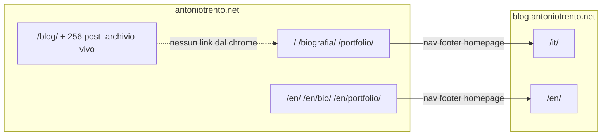

# Piano: blog nuovo + inglese sul sito principale

Stato: **parcheggiato** (18 agosto 2026). Non eseguire finché non lo chiedi esplicitamente.

Repo di questo file: `antoniotrento-net.github.io` (sito live `antoniotrento.net`).
Fase 4 si fa nel repo gemello `blog.antoniotrento.net`.

---

## Decisioni già prese

- **Italiano resta su `/`.** Niente prefisso `/it/`. L’inglese è solo additivo sotto `/en/`.
- **Menu/footer puntano al blog nuovo.** I 256 post su `antoniotrento.net/blog/` restano online e indicizzati, ma **orfani dal link building** (niente link dal nav, footer, homepage).

Il blog (`blog.antoniotrento.net`) ha già IT/EN con `lang`, `alt_url`, `_data/navigation_*.yml`. Il sito principale **non lo copia alla lettera** sul routing: qui `/it/` è un redirect stub verso `/`, e spostare l’italiano romperebbe SEO e i link che il blog già manda a `/portfolio/`, `/biografia/`, `/contatti/`.

---

## Freeze: non toccare

Regressione = cambiare ciò che già gira. Fuori scope fino a ordine esplicito:

- Tutti i file in `_posts/` e `blog/index.html` (listing + paginazione restano)
- Corpi dei progetti in `_portfolio/` (fase 5, dopo)
- Copy italiana di `biografia.html`, `privacy-policy.html`, `cookie-policy.html`
- Layout legacy (`default_backup.html`, `nav-bar.html`, `footer.html` Bootstrap)
- Stub `/it/` che già reindirizzano a `/` (corretti con questa strategia)
- `assets/js/antigravity.js` (tema/menu: nessun path italiano)

**Non “sistemare” di striscio** il mismatch `/portfolio/` vs `portfolio.html` senza verificare l’URL live. Se oggi `/portfolio/` già funziona, non si tocca.

---

## Checklist

- [ ] Fase 1: nav, footer, teaser homepage → `blog.antoniotrento.net/it/`; fix `relative_url` su URL assoluti; togliere `site.posts` dal teaser
- [ ] Fase 2: `_data` navigation/ui, `html lang`, switcher, logo per-lingua — stesso deploy della fase 3
- [ ] Fase 3: `/en/` home, bio, portfolio listing, legal, contact + hreflang; FAQ in `_data`
- [ ] Fase 4: `navigation_en.yml`, `site_links.yml`, footer/CTA del blog verso path `/en/` del principale
- [ ] Gate: URL IT, `/blog/` archivio e post vecchi invariati; nessuna modifica a `_posts/` o layout legacy

---

## Fase 1 — Solo il blog nuovo (sito principale)

Obiettivo: una diff piccola, visibile, zero i18n.

File:

- `_config.yml` `navigation`: Blog `url` da `/blog/` a `https://blog.antoniotrento.net/it/`
- `_includes/antigravity_nav.html`: come sul blog, se `item.url` contiene `://` non passare da `relative_url` (altrimenti Jekyll può rompere l’assoluto)
- `_includes/antigravity_footer.html`: `/blog/` → `https://blog.antoniotrento.net/it/`
- `index.html` sezione `#blog` (“Dal Blog.”): **togliere** il loop `site.posts limit:3` (è link building verso l’archivio). Sostituire con teaser + CTA verso `https://blog.antoniotrento.net/it/` (titoli/link fissi ai pillar o home del blog nuovo, non ai 256 post vecchi)

Gate: Home, Portfolio, Biografia, Contatti identici. `/blog/` e un post vecchio a caso restano aperti se si incolla l’URL.

---

## Fase 2 — Infrastruttura i18n (ancora senza pagine EN)

Stesso pattern del blog, adattato al root italiano.

- `_config.yml`: `languages: ["it", "en"]`, `default_lang: it`. Togliere l’array `navigation:` (spostato in data).
- Nuovi `_data/navigation_it.yml` e `_data/navigation_en.yml` (Home, Blog, Portfolio, Biografia/Bio, Contatti). Blog IT → `.../it/`, Blog EN → `.../en/`.
- Nuovo `_data/ui.yml` (o `footer_it` / `footer_en`) per tagline, colonne Servizi/Azienda/Legale, “Cambia Tema”. Niente stringhe italiane hardcodate nel footer/nav.
- `_layouts/default.html`: `<html lang="{{ page.lang | default: site.default_lang }}">`
- Nav: switcher IT | EN come `blog.antoniotrento.net/_includes/antigravity_nav.html`: `page.alt_url` se c’è, altrimenti fallback `/en/` (mai un `replace: '/it/'` — sul principale l’italiano non ha `/it/` nel path)
- Logo: `href` = `/` se IT, `/en/` se EN
- Front matter **additivo** sulle pagine IT esistenti: `lang: it` + `alt_url` verso la coppia EN (ancora 404 finché non esiste la fase 3 — **non pubblicare la fase 2 da sola**)

Gate: build Jekyll ok; pagine IT pixel-identiche a parte lo switcher. Lo switcher si attiva solo insieme alla fase 3.

---

## Fase 3 — Pagine EN core (stesso deploy della 2)

Albero nuovo, zero spostamenti IT:

- `/` → `/en/`
- `/biografia/` → `/en/bio/`
- `/portfolio/` → `/en/portfolio/`
- `/privacy-policy/` → `/en/privacy-policy/`
- `/cookie-policy/` → `/en/cookie-policy/`
- `/contatti/` (form Google) → `/en/contact/` (stesso form)
- `404.html` → copy EN nello stesso 404, o pagina `/en/` 404 se serve

Tradurre in questa fase: homepage (hero, filosofia, metodo, servizi, FAQ da `_config.yml` → `_data/faq.yml` con `it`/`en`), biografia, listing portfolio (**chrome EN**; i 19 progetti restano in italiano nel listing, niente traduzioni inventate), legal, 404, sezione blog homepage → `blog.antoniotrento.net/en/`.

SEO: in `_includes/seo.html` aggiungere `hreflang` + `x-default` verso l’IT (come il blog). `og:locale` `it_IT` / `en_US`.

Footer EN: ancore interne `/en/#services`, `/en/bio/`, ecc. Non puntare a path IT.

Gate checklist anti-regressione (manuale, prima di commit):

- `/`, `/biografia/`, `/portfolio/`, un progetto portfolio, `/privacy-policy/`, un URL post vecchio (`/qualche-slug/`) invariati
- `/blog/` ancora lista i vecchi post
- Nav IT → blog `/it/`; nav EN → blog `/en/`
- Switcher IT↔EN sulle coppie; su un post vecchio senza `alt_url` lo switcher va a `/en/` (home EN), non 404 sul post

---

## Fase 4 — Blog repo (dopo che `/en/` esiste)

Repo: `blog.antoniotrento.net`.

Oggi `_data/navigation_en.yml` e `_data/site_links.yml` mandano anche l’EN su path italiani (`/portfolio/`, `/biografia/`). Va aggiornato **solo dopo** la fase 3:

- Portfolio → `https://antoniotrento.net/en/portfolio/`
- Bio → `https://antoniotrento.net/en/bio/`
- Home `main: true` → `https://antoniotrento.net/en/`
- Footer blog: `site.main_site` + path in base a `page.lang`
- CTA/popup EN già hanno copy EN ma URL italiani: allinearli

Non toccare i permalink del blog.

---

## Fase 5 — Dopo (non in questo giro)

- Traduzione dei 19 `_portfolio/*.md` (front matter `title_en` / file EN, o `lang` + `alt_url` per item)
- Eventuale `permalink: /portfolio/` su `portfolio.html` solo se il live è già quello
- Non tradurre i 256 post vecchi

---

## Ordine di merge

Due PR sul sito principale, una sul blog:

1. **PR A** = solo fase 1 (blog nel chrome). Si può mettere online subito.
2. **PR B** = fasi 2+3 insieme (i18n + pagine EN). Mai merge della 2 senza la 3.
3. **PR C** = fase 4 sul repo `blog.antoniotrento.net`.

Niente “mentre ci sono sistemo anche…”. Ogni PR ha il gate sopra. Commit solo se lo chiedi tu.

Quando riprendi: apri questo file e di’ da quale fase partire. La cartella `_piano_editoriale` è già in `exclude` di `_config.yml`, quindi Jekyll non pubblica il piano.
